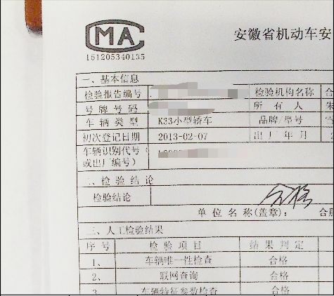
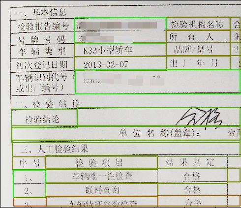
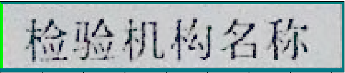

# Table-Extraction-and-Chinese-OCR
Extract the outline of the table from the paper form obtained from the photo or the electronic document and recognize the text content in the outline. 从拍照得到的纸质表格或者是电子表格中检测出表格轮廓并提取出这些轮廓，对每个轮廓内的内容进行识别。  
过滤掉表格外的表头等文字信息，只关注于表格轮廓内的内容。

# 数据准备
创建data/img和data/test和data/temp目录  

1.如果表格比较大，文字较小，需要进行以下操作：  
  1）将要识别的图片数据放入data/img/目录下。  
  2）根据要识别的表格内容，更改jiequ.py文件中第20行，更改需要在原图上截取的范围。  
  3）运行jiequ.py  
2.如果表格较小，文字较大，易识别，直接将图片放入到data/test/目录下即可

# 模型文件（参考models目录）
下载地址:http://www.chineseocr.com:9990/static/models/darknet-ocr/

# 环境配置
支持系统:mac/ubuntu python=3.6
依赖安装:pip install -r requirements.txt
编译对GPU的支持:cd darknet && cp  Makefile-GPU Makefile && make
编译对CPU的支持:cd darknet && cp  Makefile-cpu Makefile && make

# 运行
python demo.py在data/temp目录下会生成裁剪下来的每一个小框的内容，然后再运行app.py(参考darknet-ocr的使用方法)就可以对每一个小格的内容进行识别了。  
为了使提取的内容较易识别，我注释掉了formatcut的第110行，如果希望可视化在图片上的表格框的标注，请取消掉该行的注释。  
如果希望一步到位，直接可以识别出每个小表格内的内容，那么请取消掉formatcut.py中6，7，125，126行的注释，这样就会对图片中的每一个识别出来的小框的内容进行识别（但这一步操作一定要注释掉第110行），不用一个一个的用app.py去识别了。 执行python demo.py。 

# 可视化视图
  

# 参考
darknet-ocr:https://github.com/chineseocr/darknet-ocr
